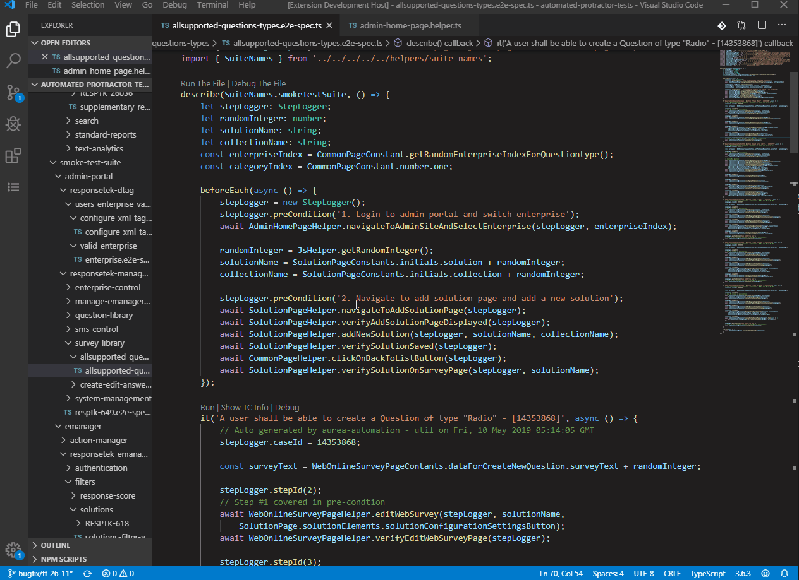
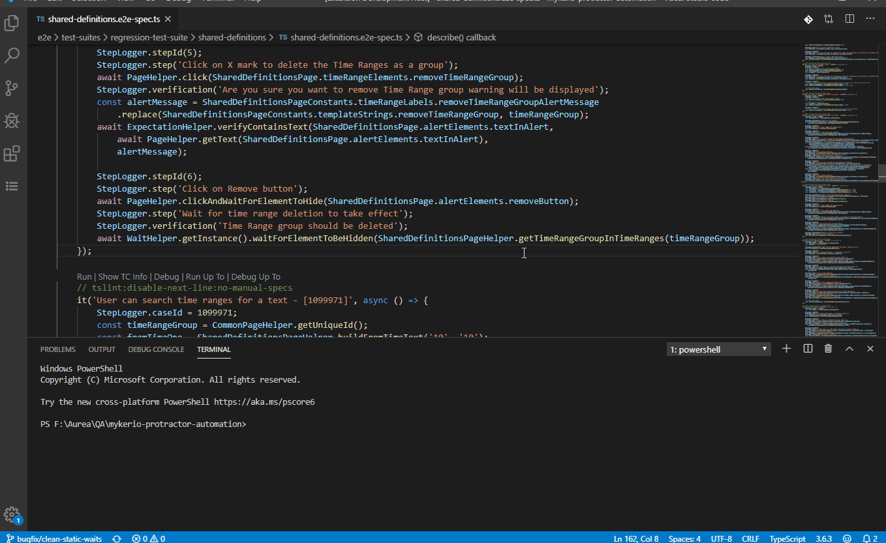

## Features

1. Provides a convenient way to start and debug individual tests.
2. You can pull an allure report from Jenkins, store it in local DB (SQLite is being used)
3. You can assign a comment for specific test cases (when you want to leave a note for yourself).
4. You can navigate and see statuses of the tests in tree view.

## Extension Settings

This extension contributes the following settings:
* `xoQAMaintCIJobAnalyzer.jenkinsUser`: The username used for authentication in the Jenkins
* `xoQAMaintCIJobAnalyzer.jenkinsToken`: The token used for authentication in the Jenkins
* `xoQAMaintCIJobAnalyzer.db`: A path to a local SQLi DB for the project. Project-specific.
* `xoQAMaintCIJobAnalyzer.screenshotsPath`: path where screenshots should be saved. Default to the same folder as the db
* `xoQAMaintCIJobAnalyzer.jenkinsJob`: "A path to a CI job. Example: http://jervis.aureacentral.com/job/Exinda/job/exinda_exos_jenkins/job/enq-qa-integration/job/exinda-exos-protractor-devqa-automation/. Project-specific.
* `xoQAMaintCIJobAnalyzer.pathFromRoot`: path where test suites are suited in the project
* `xoQAMaintCIJobAnalyzer.dataRetentionPolicy`: when to clean the stored data

## Known Issues

https://github.com/astafev/vscode-plugin-xo-qa-maintenance/issues

## Release Notes

### 0.0.1

Initial release

### 0.0.2

Add demo, some polishing.